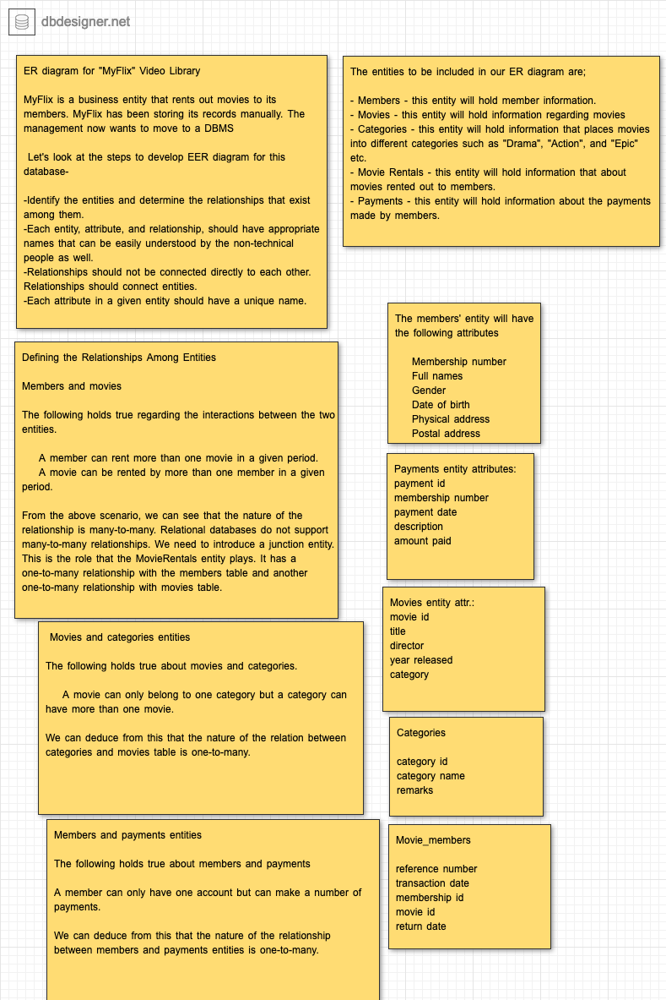

# Class Exercises

## Exercise 1

Create the ERD for MyFlix which is described below:

Export this ERD and then import in pgAdmin. 

## Exercise 2

### ArtBase

- Although you always wanted to be an artist, you ended up being an expert on databases because you love to cook data and you somehow confused database with data baste. Your old love is still there, however, so you set up a database company, ArtBase, that builds a product for art galleries. The core of this product is a database with a schema that captures all the information that galleries need to maintain.
- Galleries keep information about: 
  - **artists**, their names (which are unique), birthplaces, age, and style of art. 
  - For each piece of **artwork**, the artist, the year it was made, its unique title, its type of art (e.g., painting, lithograph, sculpture,photograph), and its price must be stored. 
  - Pieces of artwork are also classified into **groups** of various kinds, for example, portraits, still lifes, works by Picasso, or works of the 19th century, a given piece may belong to more than one group. Each group is identified by a name (like those just given) that describes the group. 
  - Finally, galleries keep information about **customers**. For each customer, galleries keep that person's unique name, address, total amount of dollars spent in the gallery (very important!), and the artists and groups of art that the customer tends to like.
- Draw the ER diagram for this database.
- Generate ERD also from pgAdmin.

## Exercise 3

- Import ArtBase ERD which you have just created to your pgAdmin

## Exercise 4

- Import the Chinook DB to your pgAdmin, you can download this DB from the following link: 
https://github.com/lerocha/chinook-database/tree/master/ChinookDatabase/DataSources . You just need to download `Chinook_PostgreSql.sql` file.

## Exercise 5

- Now, connect to this imported Chinook database from python code.

